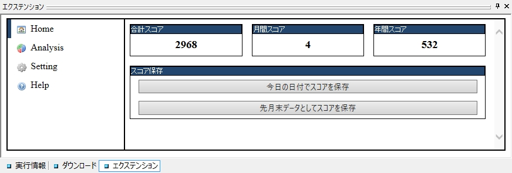

# YogWbScoreTools

## これは何？

[WhiteBrowser](https://w.atwiki.jp/whitebrowser/)のスコアを使って、いろんな分析をするためのエクステンションです。以下のようなことができます。

1. 毎月初めに、スコアのスナップショットをTSVファイルとして自動保存できます。それをもとに以下のような分析を行うことができます。
2. 先月のスコアファイルを元に、今月どれぐらいスコアが増えたか
3. 1年分のスコアファイルを元に、年間でどれぐらいスコアが増えたか
4. 1年分のスコアファイルを元に、今年にスコアが増加したファイルはなにかをリストアップ
5. スコアが0のファイルと、それ以外のファイルの比率がどんなものか
6. 全ファイルの合計スコアの算出
7. スコア増減時にアラートでどのファイルを操作したか通知

## インストール方法

WhiteBrowser 公式サイトのアップローダーは 100KB 制限があって、このでかいエクステンションはアップロードできないので、代わりにVectorで配布しています。

zipファイルを展開すると「#YogWbScoreTools」というフォルダができるので、これをフォルダごと「%WhiteBrowser%\skin」にコピーすることで使えるようになります。

## アンインストール方法

展開した「#YogWbScoreTools」を消してください。

## 使い方

1. まずこのエクステンションを開くと、現在のスコアデータを「%WhiteBrowser%\temp」に保存します。これは毎月一回行われ、既にファイルがある場合は行われません
2. これを毎月やっていると、どんどんデータがたまっていき、意味がある値を出せるようになってきます
3. 後は Home や Analiysis タブにあるツールでスコアを眺めます

## このエクステンションを使う上での運用

このエクステンションは蓄積されたスコアデータがないとあまり意味があることができないので、このエクステンションを使う上では以下のような使い方が推奨されます。

1. 管理ファイルは同じものを使いまわしてください。
2. スコアは基本的に後からは減らさないでください。
3. スコアを増加させる時にはこのエクステンションを開いてください。月の最初に起動することで自動でスコアデータを保存します。
4. このエクステンションは毎月一回は立ち上げてください。先のスコアデータ保存のためです。

## 動作環境

WhiteBrowserのエクステンションなので、当然 WhiteBrowser が動作には必須です。

Windows 10 v1903に搭載されているのと同じIEコンポーネントがWhiteBrowser上で動く環境なら動作します。
IE10しか載ってないような環境では、まず動きません。

## ライセンス

GPLv3のフリーソフトウェアとして、利用、修正、再配布は自由に行なえます。

修正したい場合のWebpackされていないソースコードは[作者のGithubリポジトリ](https://github.com/yogsite/yog_wb_scoretools)にあるので、そちらから取得してきてください。

## 更新履歴

### 1.0.1.0

- enhancement
  - [年間スコアと年間スコア増加ランキングで何年のを見るか指定できるようにする](https://github.com/yogsite/yog_wb_scoretools/issues/1)
  - [前回スコアを増加した日時とファイル情報を記録するようにする](https://github.com/yogsite/yog_wb_scoretools/issues/2)
  - ライブラリの更新など

### 1.0.0.0

完成

## 著作権情報

### 2019 (c) Yog

- GitHub: https://github.com/yogsite/yog_wb_scoretools
- 連絡先：yogsitex@outlook.jp
